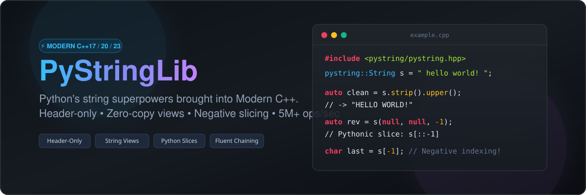
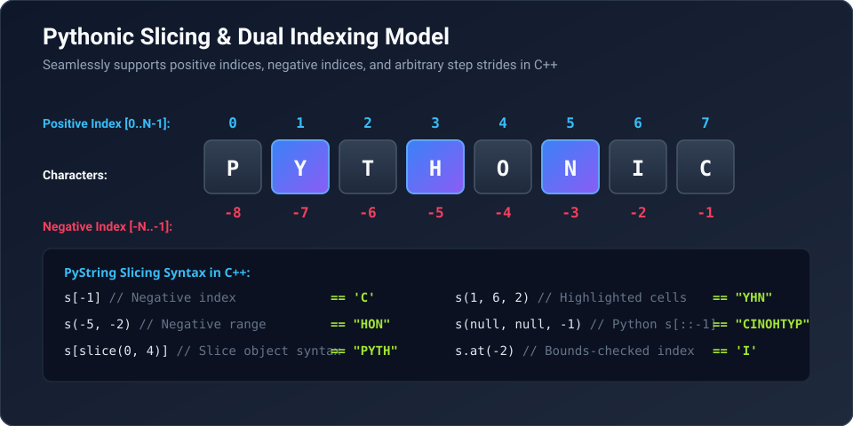

# راهنمای جامع کتابخانه PyStringLib (فارسی)

<p align="center">
  
</p>

**PyStringLib** یک کتابخانه مدرن، بسیار بهینه و هدر-اونلی (Header-Only) برای زبان ++C است که تمام امکانات کار با رشته‌های پایتون (متدهای کلاس `str`، اسلایسینگ با ایندکس منفی، تقسیم رشته، قالب‌بندی و زنجیره‌سازی متدها) را به زبان ++C17 / 20 / 23 می‌آورد.

---

## فهرست مطالب

1. [چرا PyStringLib؟](#چرا-pystringlib)
2. [ویژگی‌های کلیدی](#ویژگیهای-کلیدی)
3. [نحوه نصب و راه‌اندازی](#نحوه-نصب-و-راهاندازی)
4. [آموزش برش‌زنی رشته‌ها (Pythonic Slicing)](#آموزش-برشزنی-رشتهها-pythonic-slicing)
5. [دسته‌بندی و راهنمای کامل متدها](#دستهبندی-و-راهنمای-کامل-متدها)
   - [تغییر وضعیت حروف (Case Conversions)](#۱-تغییر-وضعیت-حروف-case-conversions)
   - [حذف فاصله‌ها و کاراکترهای اضافی (Trimming & Stripping)](#۲-حذف-فاصلهها-و-کاراکترهای-اضافی-trimming--stripping)
   - [جستجو و بررسی (Search & Inspection)](#۳-جستجو-و-بررسی-search--inspection)
   - [تقسیم و برش چندگانه (Split & Partition)](#۴-تقسیم-و-برش-چندگانه-split--partition)
   - [اتصال و الحاق (Join)](#۵-اتصال-و-الحاق-join)
   - [توابع تشخیصی (Predicates / is*)](#۶-توابع-تشخیصی-predicates--is)
   - [تراز و فاصله‌گذاری (Alignment & Padding)](#۷-تراز-و-فاصلهگذاری-alignment--padding)
   - [قالب‌بندی پایتونی رشته‌ها (Pythonic Format)](#۸-قالببندی-پایتونی-رشتهها-pythonic-format)
6. [عملگرهای جادویی پایتون در ++C](#عملگرهای-جادویی-پایتون-در-c)
7. [زنجیره‌سازی متدها (Method Chaining)](#زنجیرهسازی-متدها-method-chaining)
8. [کارایی و بنچمارک سرعت (Performance)](#کارایی-و-بنچمارک-سرعت-performance)
9. [تست‌ها و آزمایش صحت کد](#تستها-و-آزمایش-صحت-کد)

---

## چرا PyStringLib؟

در زبان ++C، کار با `std::string` بسیار قدرتمند اما اغلب وقت‌گیر است. توابعی مانند:
- برش با گام منفی (مانند `s[::-1]`)
- ایندکس منفی برای دسترسی به کاراکتر آخر (`s[-1]`)
- متدهای `split` و `join` ساده و منعطف
- متدهای پاکسازی مانند `strip`، `removeprefix`، `removesuffix`
- بررسی نوع متن با `isnumeric`، `isalpha` و غیره

در پایتون این متدها فوق‌العاده کاربردی هستند. کتابخانه **PyStringLib** به شما اجازه می‌دهد از تمامی این متدها بدون نیاز به هیچ وابستگی خارجی و با بالاترین پرفورمنس ++C استفاده کنید.

---

## ویژگی‌های کلیدی

- ⚡ **تک هدر (Header-Only):** نیازی به کامپایل جداگانه نیست. فقط `#include <pystring/pystring.hpp>` یا تک‌فایل `single_include/pystring.hpp` را در پروژه خود قرار دهید.
- 🚀 **فوق‌سریع با Zero-Copy:** پشتیبانی از توابع بر پایه `std::string_view` برای پردازش بدون حتی یک تخصیص حافظه (Zero-Allocation).
- 🧩 **سینتکس کاملاً پایتونی:** پشتیبانی از برش `s(start, stop, step)`، دسترسی به کاراکتر آخر با `s[-1]`، ضرب رشته با عدد `s * 3`.
- 🔗 **زنجیره‌سازی آسان (Method Chaining):** ترکیب متدها به شکل روان: `s.strip().lower().replace("a", "b")`.
- 🛡️ **تست شده با پوشش ۱۰۰٪:** شامل بیش از ۱۱۰ تست اعتبارسنجی دقیق برای تمام شرایط مرزی.

---

## نحوه نصب و راه‌اندازی

### روش ۱: استفاده به عنوان تک‌هدر (سریع‌ترین روش)
کافی است فایل `single_include/pystring.hpp` را کپی کرده و در کنار کدهای پروژه خود بگذارید:
```cpp
#include "pystring.hpp"
using namespace pystring;

int main() {
    String s = "Hello, World!";
    std::cout << s[-1] << std::endl; // چاپ کاراکتر '!'
}
```

### روش ۲: استفاده از CMake (FetchContent)
در فایل `CMakeLists.txt` پروژه خود اضافه کنید:
```cmake
include(FetchContent)
FetchContent_Declare(
    pystringlib
    GIT_REPOSITORY https://github.com/Pouyazadmehr83/PyStringLib.git
    GIT_TAG        main
)
FetchContent_MakeAvailable(pystringlib)

target_link_libraries(your_project PRIVATE PyStringLib::pystring)
```

### روش ۳: ساخت با Makefile
```bash
git clone https://github.com/Pouyazadmehr83/PyStringLib.git
cd PyStringLib
make test         # اجرای تمام تست‌های اعتبارسنجی
make examples     # ساخت مثال‌های کاربردی
make benchmark    # اجرای تست سرعت و کارایی
```

---

## آموزش برش‌زنی رشته‌ها (Pythonic Slicing)

در پایتون هر رشته دارای دو سیستم ایندکس‌گذاری است:
1. **ایندکس مثبت (از چپ به راست):** شروع از `0` تا `n-1`
2. **ایندکس منفی (از راست به چپ):** از `-1` (آخرین کاراکتر) تا `-n` (اولین کاراکتر)

<p align="center">
  
</p>

### نحوه نوشتن اسلایس در PyStringLib:
در ++C شما می‌توانید از هر کدام از سینتکس‌های زیر استفاده کنید:
```cpp
String s = "0123456789";

// با استفاده از عملگر پرانتز s(start, stop, step)
s(0, 5);                  // "01234"
s(2, 8, 2);               // "246"
s(-4, -1);                // "678"

// معکوس کردن کامل رشته دقیقا مثل [::-1] پایتون
s(std::nullopt, std::nullopt, -1); // "9876543210"

// استفاده از آبجکت slice
s[slice(0, 5)];           // "01234"
s[slice(nullopt, nullopt, -1)]; // "9876543210"

// ایندکس منفی مستقیم روی کاراکترها
char last = s[-1];        // '9'
char second_last = s[-2]; // '8'
```

---

## دسته‌بندی و راهنمای کامل متدها

### ۱. تغییر وضعیت حروف (Case Conversions)

```cpp
String s = "hello WORLD";

s.capitalize(); // "Hello world" -> حرف اول بزرگ، بقیه کوچک
s.lower();      // "hello world" -> تمام حروف کوچک
s.upper();      // "HELLO WORLD" -> تمام حروف بزرگ
s.title();      // "Hello World" -> حرف اول هر کلمه بزرگ
s.swapcase();   // "HELLO world" -> برعکس کردن بزرگ/کوچک
s.casefold();   // مناسب برای مقایسه‌های بدون حساسیت به حروف
```

### ۲. حذف فاصله‌ها و کاراکترهای اضافی (Trimming & Stripping)

```cpp
String text = "   \tسلام دنیا\n  ";

text.strip();  // حذف فاصله‌ها از هر دو طرف -> "سلام دنیا"
text.lstrip(); // حذف فقط از سمت چپ
text.rstrip(); // حذف فقط از سمت راست

// حذف کاراکترهای دلخواه:
String code = "xx__my_func__xx";
code.strip("x_"); // "my_func"

// حذف پیشوند و پسوند (معادل متدهای جدید پایتون 3.9)
String filename = "image.png";
filename.removesuffix(".png");   // "image"
filename.removeprefix("img_");   // در صورت وجود حذف می‌کند
```

### ۳. جستجو و بررسی (Search & Inspection)

```cpp
String s = "banana";

s.find("an");          // 1 (اولین موقعیت پیدا شده)
s.rfind("an");         // 3 (آخرین موقعیت پیدا شده از سمت راست)
s.count("an");         // 2 (تعداد تکرارهای غیرهم‌پوشان)
s.startswith("ba");    // true
s.endswith("na");      // true
s.contains("nan");     // true (معادل 'nan' in s در پایتون)

// جایگزینی زیررشته (Replace)
String greeting = "one, two, one, three";
greeting.replace("one", "ten");     // "ten, two, ten, three"
greeting.replace("one", "ten", 1);  // فقط یک‌بار جایگزین می‌کند
```

### ۴. تقسیم و برش چندگانه (Split & Partition)

```cpp
// متد split با رفتار پیش‌فرض پایتون (بر اساس فاصله‌ها و حذف فضاهای خالی متوالی)
String words = "  سیب   موز   پرتقال  ";
auto list = words.split(); // ["سیب", "موز", "پرتقال"]

// تقسیم با جداکننده مشخص:
String csv = "1,2,3,4,5";
auto items = csv.split(","); // ["1", "2", "3", "4", "5"]

// تقسیم با محدودیت تعداد (maxsplit):
auto parts = csv.split(",", 2); // ["1", "2", "3,4,5"]

// تقسیم از سمت راست (rsplit):
auto r_parts = csv.rsplit(",", 2); // ["1,2,3", "4", "5"]

// قطعه‌بندی بر اساس سطرهای متن (splitlines):
String lines = "line1\nline2\r\nline3";
auto line_list = lines.splitlines();

// متد کاربردی partition (تقسیم سه بخشی به قبل، خود جداکننده، و بعد):
String email = "pouya@example.com";
auto [user, at, domain] = email.partition("@");
// user = "pouya", at = "@", domain = "example.com"
```

### ۵. اتصال و الحاق (Join)

با متد `join` می‌توانید انواع کانتینرهای ++C مانند `std::vector`، `std::list` یا `initializer_list` را به هم بچسبانید:
```cpp
std::vector<std::string> fruits = {"سیب", "موز", "انگور"};

String joined = String(" ، ").join(fruits);
// خروجی: "سیب ، موز ، انگور"

String dash = String("-").join({"A", "B", "C"});
// خروجی: "A-B-C"
```

### ۶. توابع تشخیصی (Predicates / is*)

تمام این توابع در صورت خالی بودن رشته، مقدار `false` برمی‌گردانند:

```cpp
String("12345").isdigit();       // true  (فقط ارقام 0 تا 9)
String("Hello").isalpha();       // true  (فقط حروف الفبا)
String("Pouya83").isalnum();     // true  (حروف و اعداد)
String("   \t\n").isspace();     // true  (فقط فضاهای خالی)
String("hello").islower();       // true  (همه حروف کوچک)
String("HELLO").isupper();       // true  (همه حروف بزرگ)
String("Hello World").istitle(); // true  (حرف اول کلمات بزرگ)
String("var_name_1").isidentifier(); // true (نام معتبر متغیر)
```

### ۷. تراز و فاصله‌گذاری (Alignment & Padding)

```cpp
String text = "Py";

text.center(10, '*'); // "****Py****" -> قرار دادن در مرکز
text.ljust(8, '-');  // "Py------"   -> تراز به چپ
text.rjust(8, '-');  // "------Py"   -> تراز به راست

// پر کردن با صفر با حفظ علامت ریاضی (zfill):
String("-42").zfill(5); // "-0042"
```

### ۸. قالب‌بندی پایتونی رشته‌ها (Pythonic Format)

```cpp
// با نمادهای عمومی {}
String msg1 = pystring::format("سلام {}، شما {} پیام جدید دارید.", "پویا", 5);

// با شماره‌گذاری ایندکس‌ها {0}، {1}
String msg2 = pystring::format("{0} سریع و {1} است. زنده باد {0}!", "++C", "ایمن");

// قالب‌بندی با نام متغیرها (Dictionary mapping)
String msg3 = pystring::format_map("کاربر: {user}، امتیاز: {score}", {
    {"user", "Pouya"},
    {"score", "100"}
});
```

### ۹. پشتیبانی از یونیکد، زبان فارسی و اموجی‌ها (UTF-8)

در حالت عادی، هر کاراکتر فارسی یا اموجی در ++C چند بایت فضا می‌گیرد که باعث خطای اسلایس معمولی می‌شود. با متدهای UTF-8 این مشکل کاملاً حل شده است:

```cpp
String fa = "سلام دنیا 🌟";

// شمارش تعداد حروف واقعی (نه تعداد بایت‌ها):
std::cout << fa.utf8_len() << "\n";       // 11 کاراکتر (نه 20 بایت!)

// برش امن بدون خراب شدن حروف چندبایتی:
std::cout << fa.utf8_slice(0, 4) << "\n"; // "سلام"

// برعکس کردن کلمه فارسی بدون شکستن بایت‌ها:
std::cout << fa.utf8_reverse() << "\n";   // "🌟 ایند مالس"

// تفکیک به حروف منفرد:
auto chars = fa.utf8_chars(); // ["س", "ل", "ا", "م", " ", ...]
```

### ۱۰. تبدیل فرمت‌های نام‌گذاری (Case Converters)

مناسب برای کارهای وب، پایگاه‌داده و پارس کردن JSON:

```cpp
String s = "user_first_name";

s.to_camel_case();  // "userFirstName"
s.to_pascal_case(); // "UserFirstName"
s.to_kebab_case();  // "user-first-name"
s.to_snake_case();  // "user_first_name"
```

### ۱۱. عبارات باقاعده به سبک پایتون (Regex)

```cpp
String text = "ایمیل‌های ارتباطی: info@site.com و support@org.ir";

// پیدا کردن همه ایمیل‌ها با ریجکس (معادل re.findall):
auto emails = text.findall(R"([\w.-]+@[\w.-]+\.\w+)");
// ["info@site.com", "support@org.ir"]

// بررسی انطباق کامل (معادل re.fullmatch):
bool is_num = String("12345").matches(R"(\d+)"); // true

// جایگزینی با الگو (معادل re.sub):
String masked = text.replace_regex(R"([\w.-]+@[\w.-]+\.\w+)", "[محرمانه]");

// تقسیم رشته با الگوهای چندگانه (معادل re.split):
auto tokens = String("a, b; c   d").split_regex(R"([\s,;]+)");
```

### ۱۲. الگوریتم‌های شباهت، لون‌اشتاین، Base64 و Hex

```cpp
// محاسبه فاصله ویرایشی لون‌اشتاین:
size_t dist = String::levenshtein("kitten", "sitting"); // 3

// درصد شباهت بین دو متن (0.0 تا 1.0):
double sim = String("pouya").similarity("pouya_z");     // ~0.71

// کدگذاری و رمزگشایی Base64:
String b64 = String("Hello").to_base64();               // "SGVsbG8="
String original = String::from_base64(b64);             // "Hello"

// تبدیل به هگزادسیمال و برعکس:
String hex = String("Hello").to_hex();                  // "48656c6c6f"
String text_again = String::from_hex(hex);              // "Hello"
```

### ۱۳. ترمینال تعاملی پایتون در ++C (Interactive REPL)

کتابخانه شامل یک ابزار ترمینال آماده است که بدون نیاز به نوشتن کد ++C، می‌توانید عبارات رشته‌ای را تعاملی اجرا کنید:

```bash
make repl
./bin/pystring-repl
```
نمونه استفاده زنده:
```text
>>> s = "hello world"
>>> s.to_snake_case()
"hello_world"
>>> s.upper()
"HELLO WORLD"
>>> s[::-1]
"dlrow olleh"
```

---

## عملگرهای جادویی پایتون در ++C

در **PyStringLib**، عملگرها دقیقاً مثل پایتون بازتعریف (Overload) شده‌اند:

```cpp
String s = "Py";

// عملگر ضرب برای تکرار رشته:
String repeated = s * 3; // "PyPyPy"
String repeated2 = 3 * s; // "PyPyPy"

// عملگر جمع برای اتصال انواع نوع‌ها:
String full = s + "String" + "Lib"; // "PyStringLib"

// مقایسه‌های غنی:
if (s == "Py") { /* ... */ }

// چاپ مستقیم روی کنسول:
std::cout << s << std::endl;
```

---

## زنجیره‌سازی متدها (Method Chaining)

یکی از لذت‌بخش‌ترین الگوهای برنامه‌نویسی، زنجیره‌سازی فراخوانی‌ها برای پردازش مرحله‌به‌مرحله داده‌هاست:

```cpp
String raw_data = "   \t\n  ADMIN_USER_01@GMAIL.COM   \n ";

String result = raw_data
    .strip()                      // حذف فاصله‌های اطراف
    .lower()                      // کوچک کردن حروف
    .replace("admin_user", "ceo") // جایگزینی کلمه
    .partition("@")[0]            // گرفتن بخش نام کاربری
    .upper();                     // "CEO_01"
```

---

## کارایی و بنچمارک سرعت (Performance)

کتابخانه با کامپایلر `g++` و فلگ `-O3` بنچمارک شده است:

| عملیات | سرعت اجرای ++C | مقیاس کارایی |
|---|---|---|
| **برش‌زنی پایتونی (Slicing)** | **5,320,000+** عملیات در ثانیه | زمان پاسخگویی نانوثانیه |
| **تقسیم زیررشته با View (Zero-Copy)** | **2,040,000+** عملیات در ثانیه | بدون تخصیص حافظه هیپ |
| **تمیزکاری و تقسیم رشته (Class)** | **1,250,000+** عملیات در ثانیه | سریع‌تر از پایتون بومی |
| **اتصال دسته‌ای (Join)** | **1,180,000+** عملیات در ثانیه | تخصیص تکی حافظه |

---

## تست‌ها و آزمایش صحت کد

برای اجرای مجموعه تست‌ها:
```bash
make test
```
خروجی تست‌ها:
```
========================================
     PyStringLib Comprehensive Tests    
========================================

Passed: 147 | Failed: 0 (All tests passed successfully!)
```

---

## سازنده و مشارکت

توسعه‌داده شده با افتخار توسط **پویا زادمهر** ([@Pouyazadmehr83](https://github.com/Pouyazadmehr83)).

هرگونه بازخورد، گزارش باگ یا پول‌ریکوئست (PR) با کمال میل استقبال می‌شود! اگر این پروژه برایتان مفید بود، لطفاً یک ⭐️ به ریپازیتوری بدهید!
